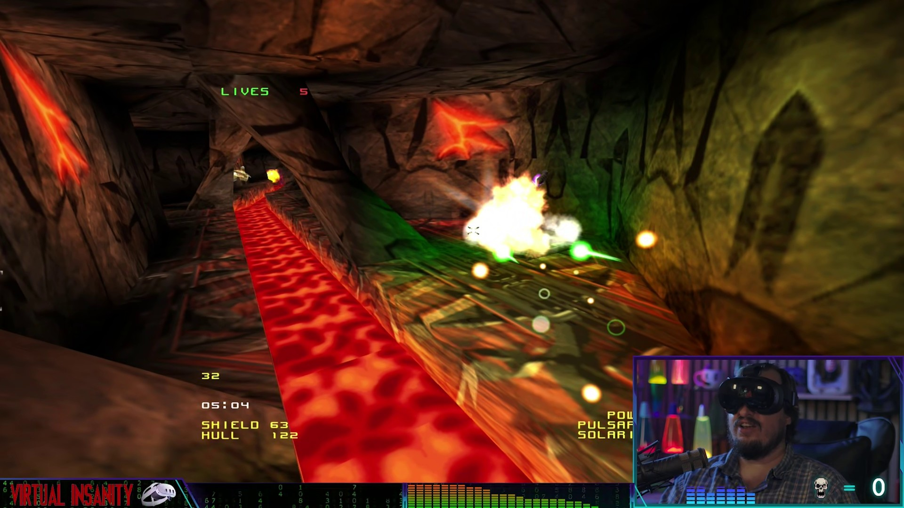
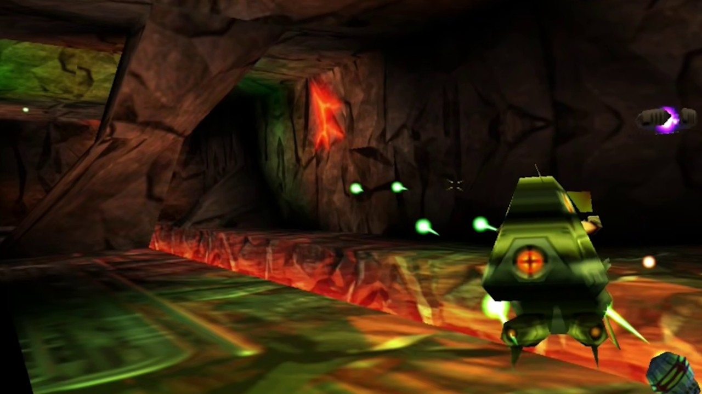
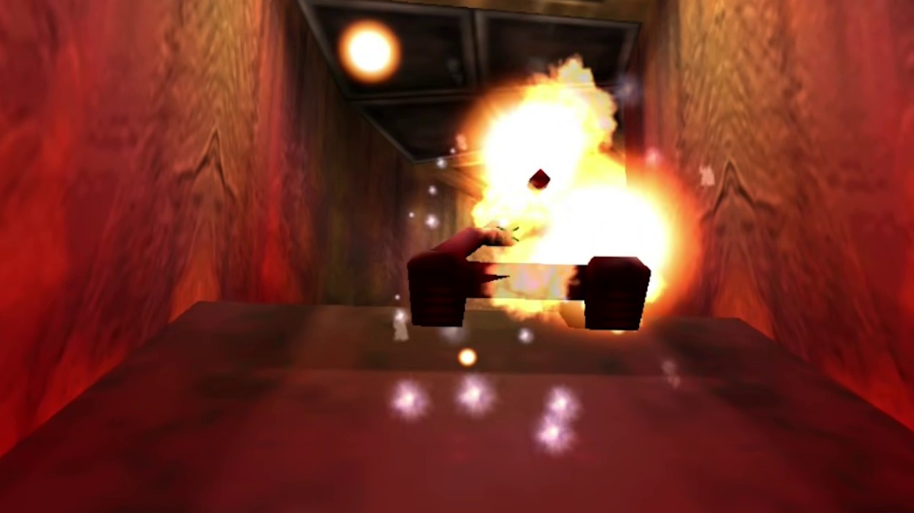

# Forsaken VR

Forsaken (1998) in a VR headset: full six-degrees-of-freedom flying, real
stereo rendering, head tracking, and controller support for the Quest and the
Steam Frame. You can start a game and play it through without taking the
headset off.

This is a source port, not an injector: OpenXR is built into the game.

**Watch the install and gameplay video:** [I Put Forsaken in VR and It's Pure Chaos](https://youtu.be/jCjcgGU_3lw)

---

## Installing

1. Unzip the download anywhere.
2. Run **`Setup.bat`**. It takes a few minutes the first time, and asks one
   question: whether to add Forsaken VR to your Steam library.
3. Connect your headset (Virtual Desktop or SteamVR), then start **Forsaken VR**
   from the desktop shortcut, or from Steam.

<a href="https://youtu.be/jCjcgGU_3lw"></a>

 

Your biker in third person, new in VR (left), and a fight in the volcano level (right).

What Setup does, all on your machine:

- **Finds your Forsaken Remastered**, if you own it (every Steam library, GOG,
  the Windows list of installed programs, the usual folders), and makes a
  **`VR` folder inside it** for Forsaken VR. You do not need the Remaster:
  without it, the VR folder goes in `Documents\Forsaken VR` (or
  `Games\Forsaken VR` in your user folder when OneDrive keeps your Documents, so
  the game is not uploaded). If you own it
  somewhere Setup cannot see, drag its folder onto `Setup.bat`.
- **Downloads the game data** (about 130 MB) from the ForsakenX project's own
  repository. That is the only download. If you already have a copy of that
  data set, drag its folder onto `Setup.bat` instead.
- **Copies the soundtrack and the intro film** from your own Forsaken
  Remastered. Both are optional; the game plays without them.
- Makes the launchers, a desktop shortcut, and **`Uninstall.bat`** and
  **`Collect logs.bat`** in the VR folder.

Nothing from the game is in this download, which is why it is only a few
megabytes.

Run `Setup.bat` again any time: to update, to repair, or after moving the game.
It never touches your pilot, saved games or settings, and keeps the data it
already fetched.

**Uninstalling:** run `Uninstall.bat` in the VR folder. It removes everything
Setup added (the game, its data, the launchers, the shortcut and the Steam
entry) and keeps your pilot, saved games and settings. Forsaken Remastered
itself is never touched.

### Optional extras from your own Forsaken Remastered

Neither is redistributed and neither is required.

```
Setup.bat -BonusLevels        the levels the Remaster has and the community data
                              set does not, including the N64 exclusives
Setup.bat -OriginalTextures   the 1998 art, for UseOriginalTextures in the settings
```

`-BonusLevels` adds 20 levels to the multiplayer level list: the N64 maps
(`aztec64`, `nuken64`, `shipn64`, `tuben64` and two unnamed ones) plus `temple`,
`biolab`, `blackhole`, `starship`, `genstation`, `munitions`, `ramqan`,
`powerdown`, `stableizers`, `final`, `defend2`, `battlebase` and a couple of test
maps. Six have no start point and drop you at the level origin (`aztec64` parks
you facing an Acclaim logo), and none carry the goals Capture The Flag needs, so
they are deathmatch and free-flight only.

`-OriginalTextures`: the data set ships community high-resolution textures. This
converts the original art out of your Remaster; then set
`UseOriginalTextures = true` in the settings. Anything without an original keeps
the high-resolution version.

### Playing

In the VR folder:

| File | What it does |
|---|---|
| **`Forsaken VR.cmd`** | The headset. Connect Virtual Desktop (or start SteamVR) **first**. |
| `Forsaken (flat).cmd` | On the monitor, as the original. No headset needed. |

Tested on a Quest 3 over Virtual Desktop (its own OpenXR runtime, VDXR) and on
the Steam Frame through SteamVR, with an RTX 4070 Ti SUPER. Virtual Desktop,
SteamVR and the Oculus runtime each behave a little differently, so if the game
misbehaves, try it on another runtime first.

**If the picture judders**, check the wireless link before anything else. On a
streamed headset a network problem looks just like a slow GPU, and 6 GHz Wi-Fi
fixed it completely in testing, at full resolution.

---

## Credits

Forsaken VR is a Game Or Die project, made with thanks to:

- **Probe Entertainment and Acclaim**, who made Forsaken in 1998.
- **[ForsakenX](https://github.com/ForsakenX/forsaken)**, the community source
  port that kept the game running for years, and the data set Setup downloads.
  Forsaken VR started from ForsakenX as of
  [July 2024](https://github.com/ForsakenX/forsaken/tree/a43c2963ab946f704b85e618959aefb6f5f469fc),
  and their copyright notices stay in the source files.
- **Nightdive Studios**, for *Forsaken Remastered*. If you own it, Setup borrows
  the soundtrack and intro film from your copy.

---

## Play style

The first time you start a game in the headset, Forsaken VR asks how you want
to aim:

- **Modern:** your hand aims. Your shots leave the ship along your controller's
  pointing line, and the game's crosshair sits where that line meets the level.
- **Classic:** the ship aims, as in 1998. Your shots go where its nose points.

Change it any time: **VR Options > Play style**. Mines drop
behind the ship either way.

---

## Controls

### Quest 3 Touch controllers

| Control | Action |
|---|---|
| Left stick | Thrust / strafe |
| Right stick | Yaw / pitch |
| Left stick click | Next primary weapon |
| Right stick click | Pull the view back behind the ship: cockpit, near, far |
| Right trigger | Fire primary |
| Left trigger | Fire secondary |
| Right grip / left grip | Rise / sink, without tilting |
| X / Y | Roll left / right |
| A | Nitro |
| B | Drop mine |
| Menu button | Pause. **Hold it** to recenter |
| Both grips together | Recenter |

**In menus:** either stick moves, A chooses, B goes back. Or **hold the grip** of
your gun hand and point at the menu screen: a mark shows where you point, the
row under it is picked, and the **trigger** chooses it.

The face buttons and stick clicks can be changed in **VR Options > Controls**,
which also has **Next secondary** and **Rear-view mirror** rows (unassigned on
Quest by default). The triggers, grips, sticks and the menu button stay where
they are.

### Steam Frame controllers

Start SteamVR before the game. While SteamVR is running, Forsaken VR uses it
for that launch, even when Windows' OpenXR runtime is another one (Virtual
Desktop's, say); Windows' setting is left as it is. The Frame gets its own
layout: the same as the Quest's wherever the Frame has the same button.

| Control | Action |
|---|---|
| Left stick / right stick | Thrust and strafe / yaw and pitch |
| Left stick click | Next primary weapon |
| Right stick click | Pull the view back behind the ship: cockpit, near, far |
| Triggers | Fire primary (right) / secondary (left) |
| Grips | Rise (right) / sink (left) |
| A | Nitro |
| B | Drop mine |
| Left / right shoulder | Roll left / right |
| D-pad right | Next secondary weapon |
| D-pad up | Rear-view mirror on and off |
| D-pad down, View or Menu | Pause. **Hold** to recenter |
| Both grips together | Recenter |

SteamVR may keep View and Menu for itself, so D-pad down pauses too.

The Frame's left controller has no X and Y, so the rolls are on the shoulders,
where your thumbs can stay on the sticks.

The Frame keeps its own map on the Controls page, separate from the Quest's.

**Left-handed?** Turn on the **Leftorium** in VR Options and the controllers
swap: the left trigger fires primary, the left hand aims and points, the left
grip rises, and A/B trade places with X/Y. The sticks stay where they are
(thrust stays on the left stick) and have their own **Swap sticks** option if
you want those swapped too.

A gamepad mirrors this layout.

### Keyboard and mouse

| Key | Action |
|---|---|
| W / S | Thrust forward / back |
| A / D | Strafe left / right |
| Space / Left Ctrl | Strafe up / down |
| Q / E | Roll left / right |
| Left Shift | Nitro |
| Left Alt | Hold to turn the arrow keys into strafe |
| Arrows / mouse | Pitch and yaw |
| Mouse buttons | Fire primary / secondary |
| Alt+Enter | In VR: the observer view between full screen and a window |

Rebind through the in-game F1 menu.

---

## VR Options

Everything VR is in the game's menus, so you can change it in the headset:

- **Pause menu > VR Options**, right under Resume. A short first page with
  **Recenter** and **Play style**, then four pages: **Hands and Aim** (Leftorium,
  swap sticks, turn speed, auto-level, swivel chair, vibration, ship bob),
  **HUD and Observer View** (HUD size, HUD on the cockpit, menu screen size and
  distance, world behind menus, rear-view mirror, missile camera, the observer
  view), **Controls** (which button does what, for the controllers in your
  hands, with Reset to defaults) and **Picture and Startup** (resolution, the
  intro).
- **Title screen > Options > Visuals > VR Options**: the same settings on one
  screen, with Controls on a page of its own.

In the headset, **Options** in the pause menu shows only what matters in VR;
**All options** at its foot brings back the full list.

Menu text and the HUD are sized separately in the headset: **Text Scale** (pause
menu, Options, Visuals) sets the menus' text, 2 to start with, and **HUD size** in VR Options
sets the HUD's.

Changes save as you make them. Resolution and the intro take effect the next
time the game starts.

| Setting | Default | |
|---|---|---|
| Play style | Modern | See Play style. |
| Turn speed | 75% | How fast the right stick turns and pitches the ship, as a share of the original game's rate. Lower is gentler on the stomach. |
| Auto-level | On | When you are not rolling, the ship slowly rolls back level, so a turn that mixes yaw and pitch does not leave you tilted. Turn it off to stay at whatever roll you leave the ship in. |
| Swivel chair | Off | For a chair that turns: turn your body and the ship turns with you, so you fly where you face and the cockpit comes round with you. The right stick still turns the ship too. |
| Ship bob | On | The gentle drift of a ship at rest, as Probe made it. Turn it off if it bothers you in the headset. |
| Vibration | On | The controllers buzz when you fire (primary in the trigger hand, secondary in the other) and both buzz when you are hit, harder for a bigger hit. |
| Leftorium (left-handed) | Off | See Controls. |
| HUD on the cockpit | On | The HUD is a see-through screen fixed in the cockpit, ahead of you: look around and it stays put, like the cockpit does. Off, it stays in front of your eyes wherever you look. |
| World behind menus | On | The pause menu's words float in front of the frozen level instead of a black room. |
| Rear-view mirror | Off | The game's rear view, at the top of the HUD. F6 on a keyboard. |
| Missile camera | On | The view from your missile while it flies, on the left of the HUD. F5 on a keyboard. |
| Observer view steady | On | The monitor shows a level, steady cut-out of your view that follows your turns but not every small head movement. Off shows the plain eye. |

### The observer view

While you play in the headset, the monitor shows the **observer view**: what a
stream or a recording sees, the game with its HUD and any menu laid over it as
you see it. It fills the monitor without a border; **Alt+Enter** puts it in a
window and back, and the game remembers which.

Menus are words floating in the world, with no screen behind them, as they are
on a monitor: the title's pages lie on the big screen in the title room, and the
pause menu floats in front of the frozen level.

### Photo mode

With the pause menu open, **click the left stick**: the menu disappears and the
game stays paused, so you can look around the frozen level and take a picture
with your headset's own capture. Click again and the menu is back. Nothing else
does anything while the menu is hidden, so you cannot pick a menu row you cannot
see.

---

## Recentering

**Squeeze both grips together**, or **hold the menu button for about half a
second**, and forward becomes wherever you are looking. Both grips work in menus
too and bring the menu screen back in front of you. A short press of the menu
button still opens the pause menu as before, and one grip on its own still rises
or sinks. **Recenter** is also the top row of VR Options, and the headset's own
recenter (holding the Meta button) works too.

Your height is left alone, and so is any tilt of your head. Only which way you
are facing, and where you are standing, move. Use it if you sat down turned, or
if tracking has drifted.

---

## If something goes wrong

Run **`Collect logs.bat`** in the VR folder. It puts the game's recent logs, any
crash report, your settings and a short description of your PC (Windows,
graphics card, VR runtime) in one zip on your desktop. Send that zip with a
line on what happened. Nothing is sent anywhere by itself.

Paths in the logs include your Windows account name, so give them a glance
before you post one publicly.

If the game starts flat on the monitor when you expected the headset, its log
has one line starting `openxr: running FLAT because` that says why. Usually
it is that Virtual Desktop was not connected yet.

When the game falls over it writes `crash.txt` beside itself (in `VR\game`), and
Collect logs picks it up. The one before is kept as `crash.prev.txt`, so starting
again does not lose it. A few kinds of failure end the game before it can write
`crash.txt`; then Windows' Event Viewer has a record of which module failed.

### Known issues

- Changing the video mode while in VR is not supported. Restart instead.

---

## Settings file and command line

The settings live in `VR\game\configs\debug.txt`. VR Options writes the VR ones
for you:

```
VRPlayStyle  = 1       1 Modern (the controller aims), 0 Classic (the ship aims)
VRResScale   = 100     per-eye resolution, as a % of what the runtime asks for
VRPanelWidth = 2.2     width of the floating menu screen, in meters
VRPanelDist  = 1.75    how far in front of you it sits, in meters
VRWorldScale = 30      world units per meter: how big the world feels
VRHudAnchor  = 1       1 = HUD fixed in the cockpit, 0 = in front of your eyes
HudFontScale = 0       HUD text size; 0 derives it from your resolution
PlayIntro    = true    play the intro film at startup
VRWorldMenu  = true    menus float in front of the frozen level
VRVignette   = 0       comfort vignette: 0 off, 1 light, 2 strong
VRShipBob    = true    the idle drift of a ship at rest
VRSwivel     = false   swivel chair: turning your body turns the ship
VRAutoLevel  = true    auto-level: the ship rolls back level when you are not rolling
VRTurnSpeed  = 75      the right stick's turn rate, % of the original game's (40 to 150)
VRVibration  = 1       controller vibration: 0 off, 1 on
VRLeftorium  = false   left-handed controls
VRSwapSticks = false   swap the thumbsticks
VRSpectator  = true    the steady observer view
VRTextScale  = 2       menu text size in the headset (Text Scale, in Visuals)
VRRearView   = false   the rear-view mirror in the headset
VRObserverWindowed = false   the observer view in a window (Alt+Enter)
```

A command line option wins for that run only, and does **not** get written back,
so trying `-vrres 50` once will not leave you stuck at 50. Add these to a
launcher:

| Option | Default | What it does |
|---|---|---|
| `-vr` | none | Use the headset. Already set in `Forsaken VR.cmd`. |
| `-vrres N` | 100 | Render resolution, as a percentage of what the runtime asks for. Drop it if your GPU struggles. |
| `-vrpanel N` | 2.2 | Menu screen width in meters. **The knob if menu text is hard to read.** |
| `-vrpaneldist N` | 1.75 | How far in front of you the menu screen sits, in meters. |
| `-vrscale N` | 30 | Game units per meter. Changes how large the world feels. |
| `-musicvol N` | 0.65 | Music volume, 0.0 to 1.0. There is also a slider in the sound menu. |
| `-nomusic` | none | Turn the soundtrack off. `-nosfx` is separate. |
| `-nointro` | none | Skip the intro film this time. |
| `-vraim:N` | 1 | Play style: 1 Modern, 0 Classic. |
| `-vrvignette:N` | 0 | Comfort vignette: 0 off, 1 light, 2 strong. |
| `-vrshipbob:N` | 1 | 0 = no idle drift. |
| `-vrswivel:N` | 0 | 1 = swivel chair. |
| `-vrautolevel:N` | 1 | 0 = no auto-level. |
| `-vrturnspeed:N` | 75 | The right stick's turn rate, % of the original game's (40 to 150). |
| `-vrvibration:N` | 1 | Controller vibration: 0 off, 1 on. |
| `-leftorium:N` | 0 | 1 = left-handed controls. |
| `-swapsticks:N` | 0 | 1 = swap the thumbsticks. |
| `-vrworldmenu:N` | 1 | 0 = menus in a black room instead of in front of the level. |
| `-vrhudanchor:N` | 1 | 1 = HUD fixed in the cockpit, 0 = in front of your eyes. |
| `-vrspectator:N` | 1 | 0 = the observer view shows the plain eye. |

---

## For tools and hubs

Setup takes the same switches as every Game Or Die port, so a launcher hub can
install and track Forsaken VR without anyone at the keyboard:

```
Setup.bat -Quiet [-GamePath "<Forsaken Remastered folder>"] [-Json]
          [-AddToSteam [-CloseSteam]] [-NoSteam] [-NoShortcuts]
Setup.bat -Detect -Json            change nothing; report the game and the install
<VR folder>\tools\setup.ps1 -Uninstall -Quiet
<VR folder>\tools\setup.ps1 -Collect -Quiet
```

- `-Quiet`: no questions, no pause, no Explorer window.
- `-GamePath`: install for this folder (several separated by `;`) without
  searching.
- `-Json`: the result as JSON on stdout and nothing else: the VR folder, the
  launchers, the installed version, whether the data is ready.
- Exit codes: **0** done, **1** nothing could be installed (no game data),
  **2** an error (Setup's log says what).
- `<VR folder>\version.txt` holds the installed version.

---

## Licence

GPL v2, same as ForsakenX. The full text is in `LICENSE`.

**The complete source for this build lives at:**
https://github.com/GameOrDie007/Forsaken-VR

The game data Setup downloads, and anything it copies out of *Forsaken
Remastered*, belong to their respective owners and are not covered by that
licence. They are never redistributed here: they come from the projects and
products that own them, onto your machine, at setup time.

The splash picture (`art/vrsplash.png`) is not covered by the GPL either. It
is © 2026 Game Or Die, all rights reserved, and may be used only as part of
Forsaken VR.

---

**Get an email when the next port ships:** follow [Game Or Die on Patreon](https://www.patreon.com/cw/GameOrDie) for free. Ports are never paywalled.
